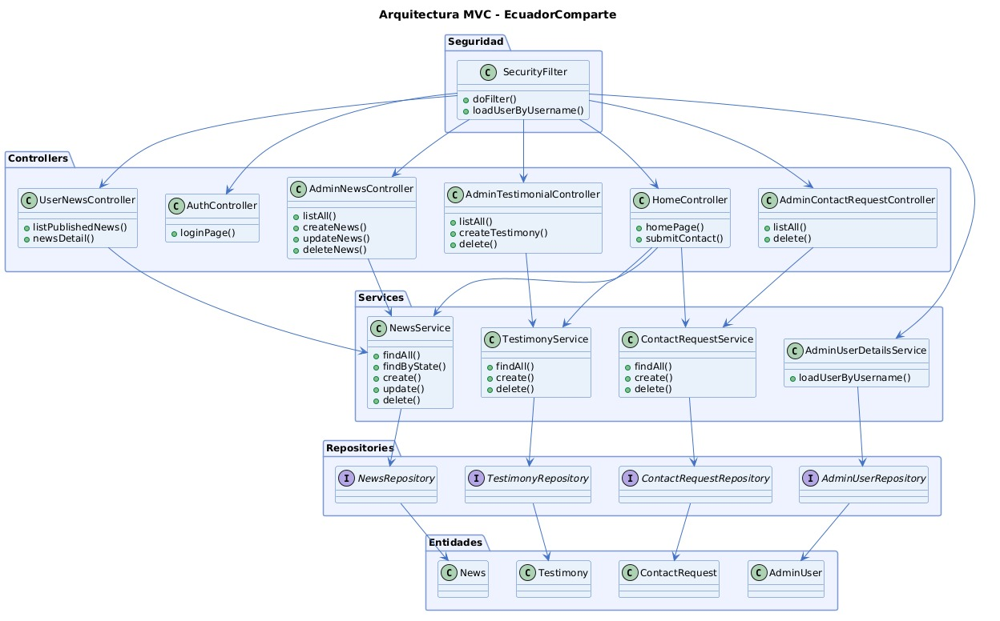
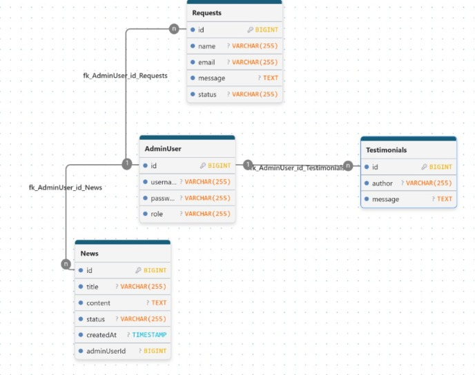
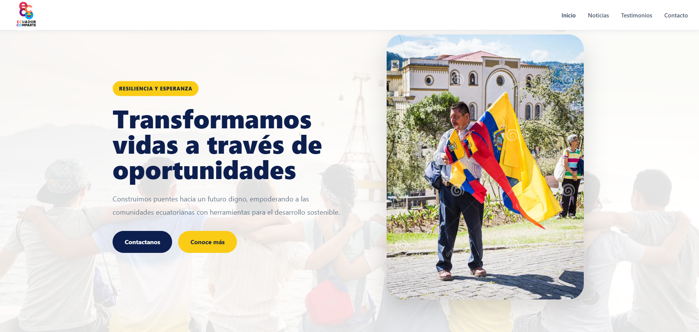
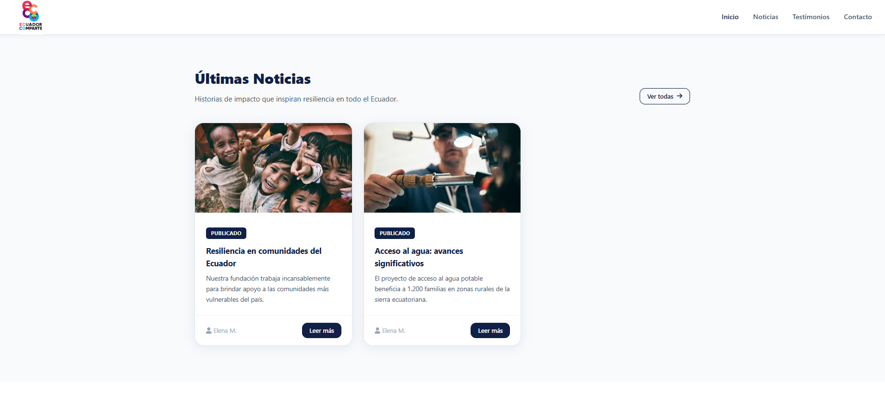
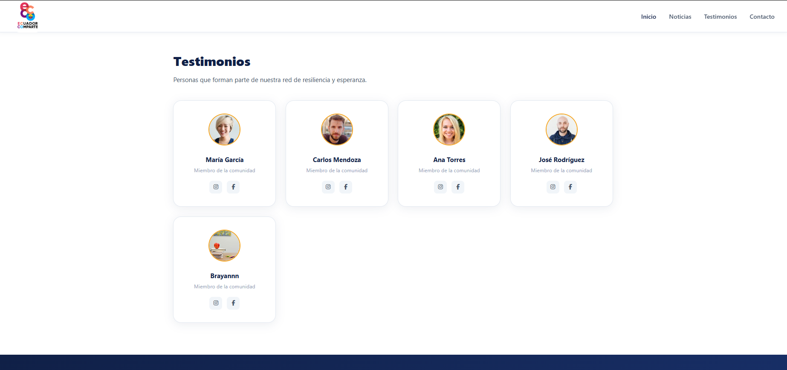
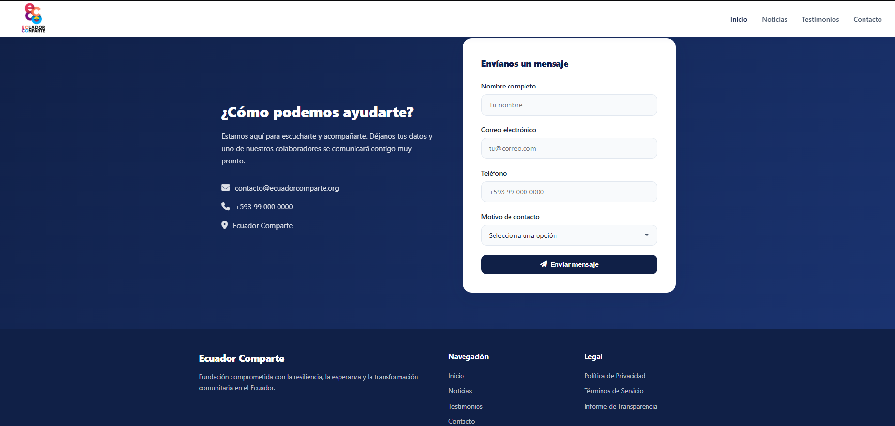
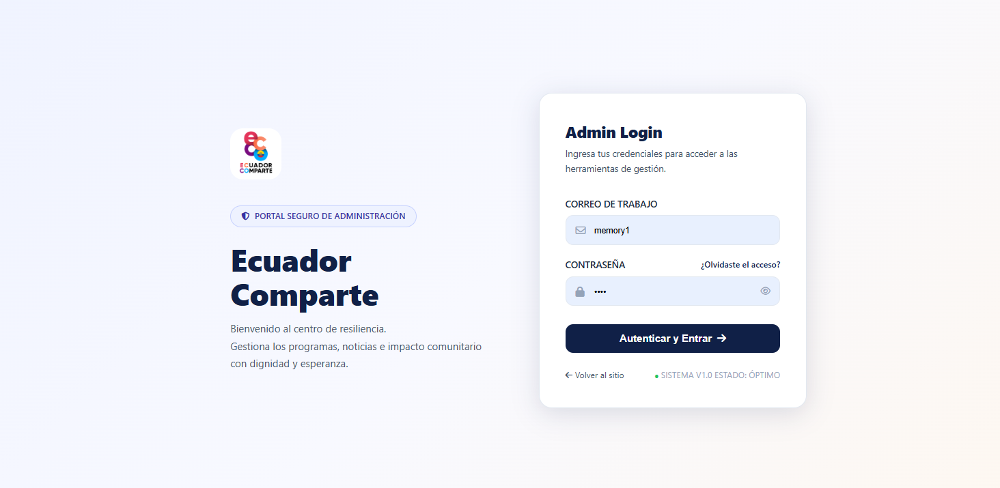
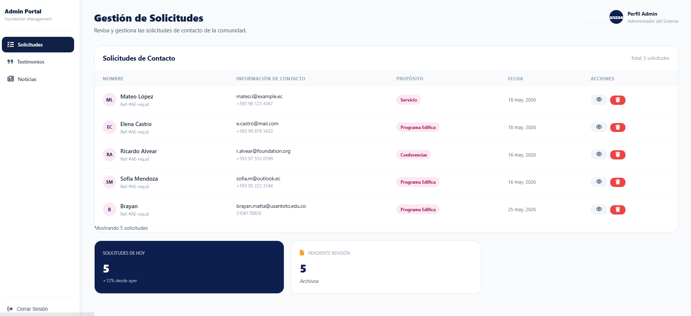
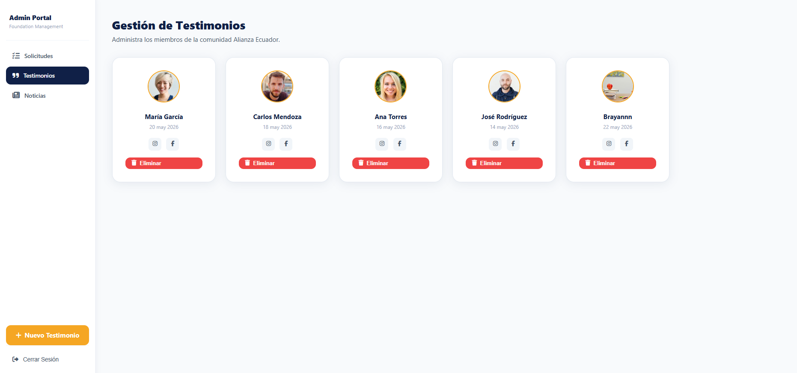
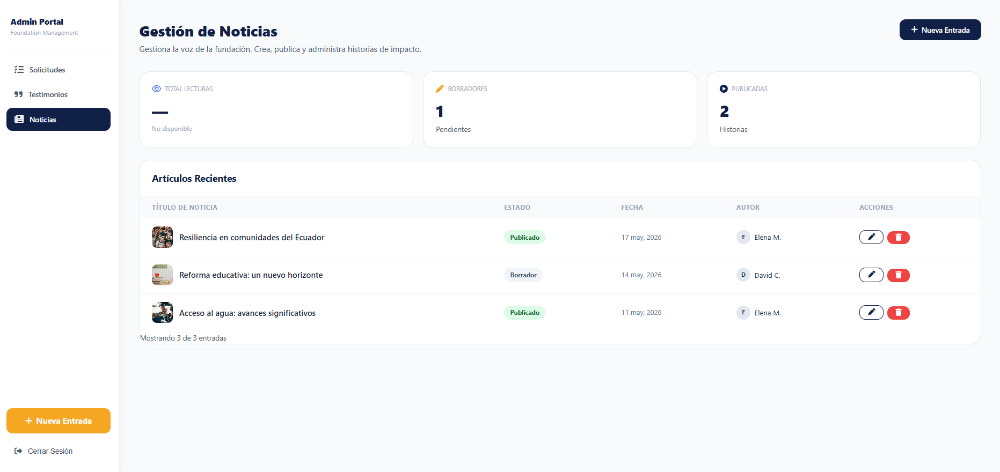

# EcuadorComparte

Plataforma web informativa y de contacto para la organización Alianza Ecuador.

---

## URL del Repositorio GitHub

```
https://github.com/LauraGTorres/DesarrolloEmpresarial/tree/main/Ecuador1
```

---

## Descripción del Proyecto

**EcuadorComparte** es una aplicación web desarrollada con Spring Boot que sirve como plataforma informativa y de contacto para la organización. 
El sistema permite publicar noticias, mostrar testimonios de miembros de la comunidad y recibir solicitudes de contacto de ciudadanos interesados.

### Funcionalidades principales

- Página de inicio pública con noticias publicadas, testimonios y formulario de contacto.
- Módulo de noticias con listado y vista de detalle para usuarios públicos.
- Panel de administración protegido con autenticación para gestionar noticias, testimonios y solicitudes de contacto.
- Seguridad basada en roles implementada con Spring Security.
- Inicialización automática de datos de prueba al arrancar la aplicación.

### Usuarios objetivo

- **Ciudadanos ecuatorianos** que deseen informarse y contactar a la organización.
- **Administradores** de la organización que gestionan el contenido del sitio.

---

## Pasos para Correr el Proyecto

### Requisitos previos

| Herramienta | Versión recomendada |
|---|---|
| Java JDK | 21 |
| Gradle | Incluido (wrapper) |
| PostgreSQL | 14 o superior |
| IntelliJ IDEA | 2023+ (recomendado) |

### 1. Clonar el repositorio

```bash
git clone https://github.com/miusuario/EcuadorComparte.git
cd EcuadorComparte
```

### 2. Configurar la base de datos PostgreSQL

Crea la base de datos en PostgreSQL:

```sql
CREATE DATABASE "ecuador-db";
```

### 3. Configurar variables de entorno / `application.properties`

El archivo de configuración se encuentra en `src/main/resources/application.properties`:

```properties
spring.datasource.url=jdbc:postgresql://localhost:5432/ecuador-db
spring.datasource.username=postgres
spring.datasource.password=12345
```

> Ajusta el usuario y contraseña de PostgreSQL según tu entorno local.

### 4. Ejecutar el proyecto

**Con IntelliJ IDEA:** Abre el proyecto, espera que Gradle sincronice y ejecuta `Ecuador1Application.java`.

**Por línea de comandos (Gradle Wrapper):**

```bash
./gradlew bootRun
```

En Windows:

```bash
gradlew.bat bootRun
```

### 5. Acceder a la aplicación

```
http://localhost:8080
```

### 6. Credenciales de prueba (admin)

| Campo | Valor |
|---|---|
| Email | `admin@alianzaecuador.org` |
| Contraseña | `Admin1234` |

> Al iniciar por primera vez, `DataInitializer` inserta automáticamente el usuario admin y datos de prueba (noticias, testimonios, solicitudes de contacto).

---

## Estructura de Carpetas

```
src/
├── main/
│   ├── java/brayanmattalauratorres/ecuador/
│   │   ├── config/
│   │   │   ├── DataInitializer.java
│   │   │   └── SecurityConfig.java
│   │   ├── controller/
│   │   │   ├── admin/
│   │   │   │   ├── AdminContactRequestController.java
│   │   │   │   ├── AdminNewsController.java
│   │   │   │   └── AdminTestimonialController.java
│   │   │   ├── user/
│   │   │   │   ├── HomeController.java
│   │   │   │   ├── UserNewsController.java
│   │   │   │   └── UserTestimonialController.java
│   │   │   └── AuthController.java
│   │   ├── model/
│   │   │   ├── constant/
│   │   │   │   ├── ContactPurpose.java
│   │   │   │   └── NewsState.java
│   │   │   ├── dto/
│   │   │   │   ├── ContactRequestDTO.java
│   │   │   │   ├── NewsDTO.java
│   │   │   │   └── TestimonyDTO.java
│   │   │   ├── entity/
│   │   │   │   ├── AdminUser.java
│   │   │   │   ├── ContactRequest.java
│   │   │   │   ├── News.java
│   │   │   │   └── Testimony.java
│   │   │   ├── repository/
│   │   │   │   ├── AdminUserRepository.java
│   │   │   │   ├── ContactRequestRepository.java
│   │   │   │   ├── NewsRepository.java
│   │   │   │   └── TestimonyRepository.java
│   │   │   └── service/
│   │   │       ├── AdminUserDetailsService.java
│   │   │       ├── ContactRequestService.java
│   │   │       ├── NewsService.java
│   │   │       └── TestimonyService.java
│   │   └── Ecuador1Application.java
│   └── resources/
│       ├── templates/
│       │   ├── admin/
│       │   │   ├── news-form.html
│       │   │   ├── news-list.html
│       │   │   ├── requests-list.html
│       │   │   ├── testimonials-form.html
│       │   │   └── testimonials-list.html
│       │   ├── auth/
│       │   │   └── login.html
│       │   └── user/
│       │       ├── home.html
│       │       ├── news-detail.html
│       │       └── news-list.html
│       ├── static/
│       │   ├── css/
│       │   │   └── style.css
│       │   └── other/imgs/
│       │       └── logo-ecuador.png
│       └── application.properties
└── test/
    └── java/brayanmattalauratorres/
        └── AlianzaEcuador1ApplicationTests.java
```

---

## Diagrama de Arquitectura (PlantUML)




## Modelo Entidad/Relación (Base de Datos)



**ENUMs utilizados:**
- `NewsState`: `PURPOSE_PUBLISHED`, `PURPOSE_DRAFT`
- `ContactPurpose`: valores de motivos de contacto definidos en la clase enum

---

## Endpoints o Peticiones Disponibles

| Funcionalidad | Ruta | Método | Descripción |
|---|---|---|---|
| Página de inicio | `/` o `/home` | GET | Muestra noticias publicadas, testimonios y formulario de contacto |
| Enviar contacto | `/contact` | POST | Registra una solicitud de contacto |
| Listado de noticias | `/news` | GET | Muestra todas las noticias publicadas |
| Detalle de noticia | `/news/{id}` | GET | Muestra el detalle de una noticia específica |
| Login admin | `/login` | GET | Página de inicio de sesión del administrador |
| Admin - noticias | `/admin/news` | GET | Lista todas las noticias (admin) |
| Admin - nueva noticia | `/admin/news/new` | GET / POST | Formulario para crear noticia |
| Admin - editar noticia | `/admin/news/edit/{id}` | GET / POST | Formulario para editar noticia existente |
| Admin - eliminar noticia | `/admin/news/delete/{id}` | POST | Elimina una noticia |
| Admin - testimonios | `/admin/testimonials` | GET | Lista todos los testimonios (admin) |
| Admin - nuevo testimonio | `/admin/testimonials/new` | GET / POST | Formulario para crear testimonio |
| Admin - eliminar testimonio | `/admin/testimonials/delete/{id}` | POST | Elimina un testimonio |
| Admin - solicitudes | `/admin/requests` | GET | Lista todas las solicitudes de contacto |
| Admin - eliminar solicitud | `/admin/requests/delete/{id}` | POST | Elimina una solicitud de contacto |

---

## Stack de Tecnologías

### Backend

| Tecnología | Versión |
|---|---|
| Java | 21 |
| Spring Boot | 3.3.5 |
| Spring Security | incluido en Spring Boot 3.3.5 |
| Spring Data JPA | incluido en Spring Boot 3.3.5 |
| Hibernate | incluido en Spring Data JPA |
| Thymeleaf | incluido en Spring Boot 3.3.5 |
| thymeleaf-extras-springsecurity6 | incluido |

### Base de Datos

| Tecnología | Versión |
|---|---|
| PostgreSQL | 14+ |
| Driver JDBC PostgreSQL | runtime, Spring Boot 3.3.5 |

### Build y Herramientas

| Tecnología | Versión |
|---|---|
| Gradle | 9.4.1 |
| Spring Boot DevTools | incluido, solo desarrollo |
| JUnit | incluido en spring-boot-starter-test |

### Frontend

| Tecnología | Descripción |
|---|---|
| HTML5 | Plantillas Thymeleaf |
| CSS3 | Estilos personalizados (`style.css`) |

### Dependencias Gradle (`build.gradle`)

```groovy
dependencies {
    implementation 'org.springframework.boot:spring-boot-starter-data-jpa'
    implementation 'org.springframework.boot:spring-boot-starter-thymeleaf'
    implementation 'org.springframework.boot:spring-boot-starter-web'
    implementation 'org.springframework.boot:spring-boot-starter-security'
    implementation 'org.thymeleaf.extras:thymeleaf-extras-springsecurity6'
    developmentOnly 'org.springframework.boot:spring-boot-devtools'
    runtimeOnly 'org.postgresql:postgresql'
    testImplementation 'org.springframework.boot:spring-boot-starter-test'
    testImplementation 'org.springframework.security:spring-security-test'
    testRuntimeOnly 'org.junit.platform:junit-platform-launcher'
}
```

---

## Capturas UI/UX











---

## Análisis Personal

### Retos encontrados

*Durante el desarrollo de EcuadorComparte, como equipo enfrentamos varios desafíos técnicos que pusieron a prueba nuestra capacidad de resolución de problemas:
Configuración de Spring Security 6: La transición a la nueva sintaxis de Spring Security (usando SecurityFilterChain en lugar del antiguo WebSecurityConfigurerAdapter) fue uno de los mayores retos. Configurar correctamente qué rutas debían ser públicas (/, /news, /contact) y proteger estrictamente el entorno de administración (/admin/), asegurando que la encriptación de contraseñas funcionara correctamente en el inicio de sesión, requirió mucha investigación y pruebas.
Integración de Enums con JPA y Thymeleaf: Manejar los estados de las noticias (PUBLICADO, BORRADOR) y los propósitos de contacto a través de clases Enum en Java fue un desafío en la capa de la vista. Tuvimos que aprender a iterar sobre estos valores en Thymeleaf para poblar dinámicamente los menús desplegables en los formularios del administrador.
Sincronización de Datos en Tiempo Real (Data Initializer): Al principio, la base de datos estaba vacía al compilar. El reto fue implementar un componente (DataInitializer) que se ejecutara al levantar el contexto de Spring, verificara si la base de datos estaba vacía y, de ser así, inyectara automáticamente el usuario administrador y los datos de prueba sin duplicarlos en reinicios posteriores.*
### Aprendizajes técnicos más valiosos

*A lo largo de la asignatura y la construcción de este proyecto, nos llevamos aprendizajes fundamentales para nuestro perfil profesional:
El poder del Patrón MVC: Entender teórica y prácticamente la separación de responsabilidades. Comprender que el Controller solo debe orquestar peticiones, que la lógica fuerte reside en el Service, y que la Vista (Thymeleaf) solo debe dedicarse a mostrar datos, nos permitió escribir un código mucho más limpio y fácil de depurar.
Manejo Ágil de Bases de Datos con Spring Data JPA: Pasamos de escribir consultas SQL manuales a utilizar interfaces JpaRepository. Aprender cómo Hibernate y JPA mapean objetos Java a tablas relacionales en PostgreSQL nos demostró cómo los frameworks modernos aceleran enormemente el desarrollo de un CRUD.
Conciencia sobre la Seguridad Web: Este proyecto nos enseñó que la seguridad no es un "extra", sino una necesidad desde el día uno. Entender la diferencia entre Autenticación (quién eres) y Autorización (qué puedes hacer) cambió nuestra perspectiva sobre cómo se debe diseñar cualquier aplicación web real.*